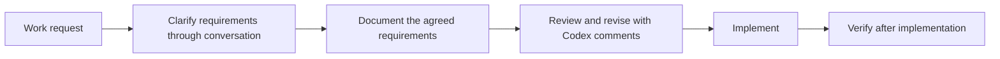

# j-token-workflow-kit

[한국어 README](README.ko.md)

TL;DR: `j-token-workflow-kit` is a Codex workflow plugin that turns rough requests into reviewable specs, code changes, and verification steps. It is designed for work that starts vague and needs to become concrete before implementation.

Current plugin version: `0.4.0`

## Why This Exists

Codex can implement quickly, but unclear requests can still produce unclear changes. This kit adds a lightweight workflow around the conversation:

- clarify the requirement through dialogue
- turn the clarified requirement into a document
- use Codex review comments to refine the document
- implement from the reviewed document
- verify the result after implementation

## Workflow



## How To Use

Start with a request that mentions the workflow you want to use:

```text
Use the workflow to organize this requirement.
```

Codex should first ask only the questions needed to reduce ambiguity. After the requirement is clear, ask it to write the document:

```text
Document this as an implementation spec.
```

Review the document with Codex's review system. Use review comments to fix missing details, risky assumptions, or unclear acceptance criteria.

When the document is ready, ask Codex to implement it:

```text
Implement this.
```

After implementation, Codex should verify the result and report what was checked.

## Included Skills

| Skill | Purpose |
|---|---|
| `requirements-to-spec` | Turns rough requirements into a concrete spec and implementation document. |
| `prd-writer` | Drafts technical PRDs for products, SDKs, CLIs, runtimes, and developer tools. |
| `technical-spec-writer` | Turns technical design notes into implementation specs with APIs, protocols, boundaries, and tests. |
| `bug-report-to-fix` | Captures bug details first, then moves into debugging and fixing after approval. |
| `figma-flow-to-implementation` | Converts Figma links, screenshots, or UI references into a screen flow and implementation spec. |
| `workflow-composer` | Combines multiple workflows when a request mixes requirements, bugs, and UI work. |
| `cognitive-writing` | Keeps documents easy to review by reducing cognitive load. |
| `branch-rule` | Defines branch naming rules. |
| `commit-rule` | Defines commit message rules. |
| `git-push-safety` | Prevents accidental pushes to the wrong branch. |
| `pr-rule` | Defines pull request writing rules. |

## Recommended Prompts

```text
Use the workflow to clarify this requirement before implementation.
```

```text
Document the agreed requirement as a spec.
```

```text
Draft this product idea as a PRD.
```

```text
Turn this runtime design into a technical implementation spec.
```

```text
Review this spec and leave comments for anything unclear.
```

```text
Apply the review comments, then implement the spec.
```

```text
Verify the implementation and summarize the result.
```

## Repository Layout

```text
.agents/plugins/marketplace.json
plugins/codex-workflow/.codex-plugin/plugin.json
plugins/codex-workflow/skills/
plugins/codex-workflow/references/
```

## License

MIT
