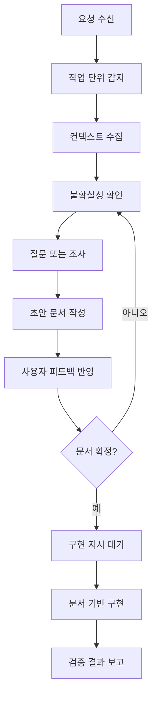
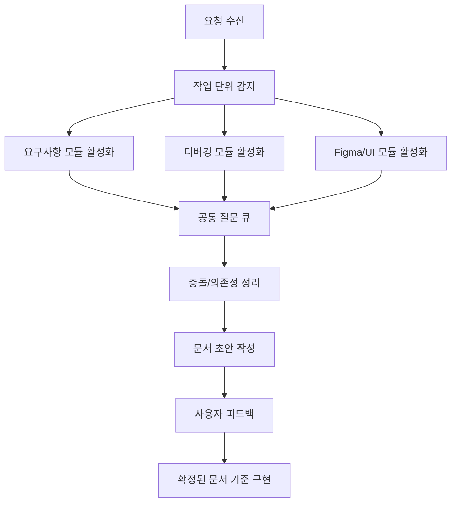
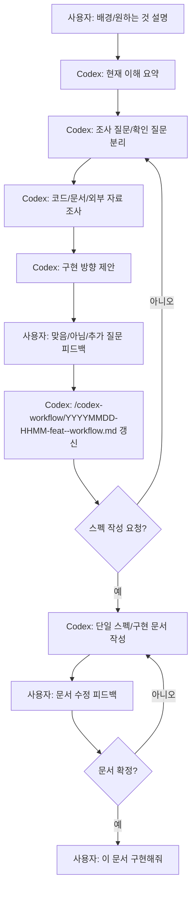
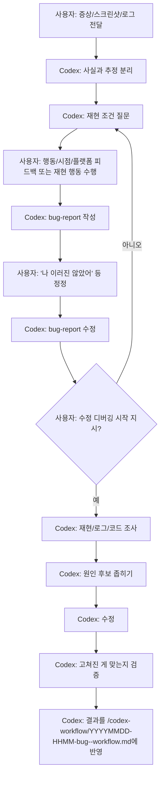
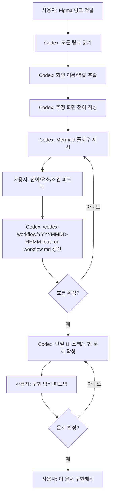
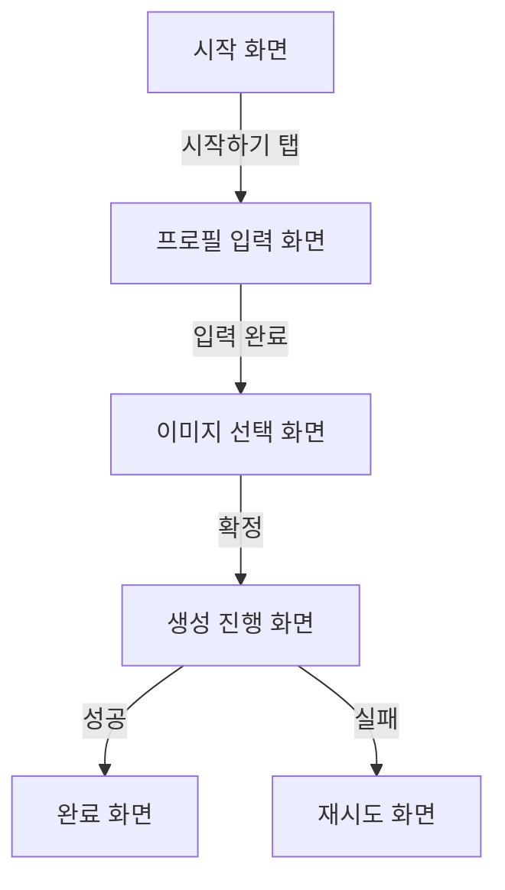

# Codex 워크플로우 플러그인 설계

## TL;DR

이 문서는 사용자의 반복 작업 3가지를 Codex 플러그인으로 구현하기 전 정리한 설계 초안이다.

세 플로우는 모두 `컨텍스트 수집 -> 확인 질문 -> 문서 초안 -> 사용자 피드백 -> 확정 문서 -> 구현` 구조를 공유한다. 차이는 입력 자료와 산출 문서의 종류다.

단, 실제 요청은 세 플로우 중 하나로 깔끔하게 분류되지 않을 수 있다. 하나의 요청 안에 요구사항 정리, 버그 조사, Figma 화면 구현이 함께 들어올 수 있으므로 플러그인은 단일 분류기가 아니라 여러 워크플로우 모듈을 조합하는 방식으로 동작해야 한다.

## 목표

사용자가 매번 같은 방식으로 설명하고, Codex가 매번 다른 방식으로 추측하는 문제를 줄인다.

플러그인은 사용자의 요청에서 필요한 워크플로우 모듈을 감지하고, 여러 모듈을 한 대화 안에서 조합한다. 각 모듈은 자기 역할에 맞는 인터뷰 질문, 조사 방식, 문서 산출물, 구현 진입 조건을 제공한다.

## 플러그인 구성

플러그인은 하나의 공통 컴포저와 세 개의 워크플로우 스킬로 구성한다.

| 구성 | 역할 |
|---|---|
| `workflow-composer` | 요청 안에서 필요한 워크플로우 모듈을 여러 개 활성화하고, 질문/문서/구현 순서를 조율한다. |
| `requirements-to-spec` | 요구사항을 인터뷰하고 스펙/구현 문서로 수렴시킨다. |
| `bug-report-to-fix` | 애매한 증상, 스크린샷, 로그를 버그 리포트로 정리한 뒤 수정한다. |
| `figma-flow-to-implementation` | Figma 링크를 읽고 화면 전이 흐름을 Mermaid로 합의한 뒤 구현 문서를 만든다. |
| `workflow-doc-state` | 각 플로우의 합의 상태를 OS 시스템 임시 디렉터리의 `codex-workflow/` 하위 문서에 남긴다. 사용자가 명시한 경우에만 레포 본문에 작성한다. |

## 공통 상태 모델

세 플로우는 같은 상태 기계를 공유하지만, 한 요청에서 여러 상태 기계가 동시에 활성화될 수 있다.



공통 원칙은 다음과 같다.

- 사용자가 말하지 않은 플랫폼, 원인, 화면 순서를 단정하지 않는다.
- 불확실한 부분은 `질문 필요`, `조사 필요`, `사용자 결정 필요`로 구분한다.
- 구현은 문서가 확정된 뒤 시작한다.
- 문서에는 채택한 결정뿐 아니라 버린 선택지도 짧게 남긴다.
- 기본 문서 저장 위치는 OS 시스템 임시 디렉터리의 `codex-workflow/` 하위 폴더다.
- 시스템 임시 디렉터리는 macOS/Linux의 `/tmp` 또는 `$TMPDIR`, Windows의 `%TEMP%`를 의미한다. 레포 내부 상대 경로 `tmp/`를 만들지 않는다.
- 임시 문서는 기록으로 남길 수 있도록 날짜/시간 접두사를 붙인다.
- 사용자가 명시적으로 지시한 경우에만 레포의 정식 문서 위치에 작성한다.
- 최종 문서는 스펙과 구현 계획을 나누지 않고 하나의 파일로 작성한다.

### 복합 요청 처리 모델

요청을 하나의 플로우로 고정하지 않는다. 대신 요청 안의 작업 단위를 감지해 활성 모듈 목록을 만든다.



예를 들어 사용자가 “이 Figma대로 화면을 만들고 싶은데, iOS에서 기존 화면이 깨지고, 최종 구현 문서도 만들어줘”라고 요청하면 세 모듈이 모두 활성화된다.

| 요청 안의 단서 | 활성화할 모듈 |
|---|---|
| 원하는 기능, 배경, 정책, 스펙 작성 요청 | `requirements-to-spec` |
| 증상, 오류, 스크린샷, 로그, 재현 요청 | `bug-report-to-fix` |
| Figma 링크, 화면, 디자인, 전이 흐름 | `figma-flow-to-implementation` |

컴포저는 모듈을 선택한 뒤 사용자에게 “1번/2번/3번 중 무엇인가요?”라고 묻지 않는다. 대신 현재 필요한 확인 질문을 하나의 질문 큐로 합쳐 중복 질문을 줄인다.

질문 순서는 사용자가 요청한 순서를 따른다. 첫 번째 요청 단위에 필요한 질문과 문서 정리를 끝낸 뒤, 두 번째 요청 단위로 넘어간다. 여러 모듈이 켜져 있어도 질문을 주제별로 섞지 않는다.

모든 모듈은 기본적으로 활성화 가능 상태다. 사용자가 명시적으로 “이 모듈은 비활성화해줘”, “이번에는 디버깅만 해줘”처럼 범위를 제한한 경우에만 나머지 모듈을 비활성화한다.

## 1. 요구사항에서 스펙/구현 문서 만들기

### 사용 패턴

사용자는 처음부터 완성된 요구사항을 주지 않는다. 배경과 원하는 방향을 먼저 말하고, Codex가 조사와 제안을 가져오면 사용자가 맞는 부분과 아닌 부분을 피드백한다.

이 플로우의 핵심은 Codex가 곧바로 스펙을 확정하지 않고, 대화 중 생기는 질문과 조사 결과를 문서의 결정 사항으로 축적하는 것이다.

### 입력

- 배경 설명
- 원하는 결과
- 사용자가 확신하지 못하는 질문
- 기존 코드, 문서, 외부 자료 조사 결과
- 사용자 피드백

### 산출물

작업 중에는 발견 문서를 임시로 유지하고, 최종 산출물은 하나의 파일로 합친다.

| 문서 | 목적 |
|---|---|
| `<system-temp>/codex-workflow/YYYYMMDD-HHMM-feat-<topic>-workflow.md` | 대화 중 나온 요구사항, 질문, 조사 결과, 결정 사항, 구현 계획을 함께 축적한다. |
| 최종 단일 문서 | 사용자가 명시적으로 요청한 경우에만 정식 위치에 작성한다. 스펙과 구현 계획을 한 파일에 둔다. |

### 플로우



### 플러그인 동작 규칙

- 처음 요청을 받으면 `현재 이해`, `확인 필요`, `조사 필요`, `제안 가능`으로 나눈다.
- 사용자가 “이렇게 돼 있나?”라고 물으면 추측하지 않고 코드/문서/자료를 먼저 확인한다.
- 사용자가 “그건 채용해줘”라고 하면 `결정 사항`으로 승격한다.
- 사용자가 “이건 빼줘”라고 하면 `제외 사항`으로 남겨 이후 구현에서 재등장하지 않게 한다.
- 구현 문서는 사용자가 명시적으로 요청하거나, 문서 확정 동의를 준 뒤 작성한다.
- 최종 문서는 `스펙 문서`와 `구현 문서`로 쪼개지 않고 하나의 문서에 작성한다.

### 문서 템플릿

```md
# 요구사항/구현 작업 문서

## 현재 목표

## 배경

## 확정된 요구사항

## 열린 질문

## 조사 결과

## 제외된 방향

## 구현 계획

## 검증 기준

## 다음 확인 사항
```

```md
# 최종 스펙/구현 문서

## TL;DR

## 범위

## 사용자 흐름

## 기능 요구사항

## 비기능 요구사항

## 구현 단계

## 검증 기준

## 리스크
```

## 2. 단순 디버깅 해결 요청

### 사용 패턴

사용자는 증상을 대충 말하거나 스크린샷만 줄 수 있다. 이때 Codex는 즉시 원인을 확정하지 않고, 어떤 행동 중 발생했는지, 언제 발생했는지, 어떤 플랫폼에서 확인했는지 물어야 한다.

중요한 점은 “iOS에서 테스트했다”가 “iOS 전용 버그”를 의미하지 않는다는 것이다. Android에서 아직 테스트하지 않았을 수도 있으므로, 플랫폼 정보는 `확인된 재현 환경`으로만 다룬다.

### 입력

- 증상 설명
- 스크린샷 또는 로그
- 재현 행동
- 발생 시점
- 테스트한 플랫폼
- 아직 테스트하지 않은 플랫폼
- 관련 코드/최근 변경 사항

### 산출물

| 문서 | 목적 |
|---|---|
| `<system-temp>/codex-workflow/YYYYMMDD-HHMM-bug-<topic>-workflow.md` | 버그 리포트, 사용자 정정, 원인 후보, 수정 계획, 검증 결과를 한 파일에 축적한다. |
| 최종 단일 문서 | 사용자가 명시적으로 요청한 경우에만 정식 위치에 작성한다. 버그 리포트와 수정/검증 내용을 한 파일에 둔다. |

### 플로우



### 플러그인 동작 규칙

- 스크린샷을 받으면 보이는 현상과 원인 추정을 분리한다.
- 플랫폼은 `확인됨`, `미확인`, `무관 가능성 있음`으로 기록한다.
- 사용자의 표현이 모호하면 바로 고치지 않고 최소 질문을 한다.
- 질문은 재현에 필요한 것부터 묻는다: 행동, 시점, 기대 결과, 실제 결과, 플랫폼, 최근 변경.
- 원인을 좁히기 위해 사용자에게 특정 재현 행동을 요청할 수 있다. 예: “아래 행동을 수행해서 버그 원인을 좁힙니다.”
- 버그 리포트 초안을 사용자에게 먼저 보여주고, 사용자의 정정을 반영한 뒤 수정에 들어간다.
- 원인 후보는 검증 가능한 형태로 적는다.
- 사용자가 “이제 수정 시작해”, “이제 디버깅 시작해”처럼 명시하기 전까지는 코드 수정에 들어가지 않는다.
- 수정 후에는 반드시 고쳐진 것이 맞는지 재현 경로, 테스트, 로그 중 가능한 방법으로 확인한다.

### 문서 템플릿

```md
# 디버깅 작업 문서

## TL;DR

## 관찰된 증상

## 사용자가 한 행동

## 기대 결과

## 실제 결과

## 확인된 환경

## 아직 확인하지 않은 환경

## 첨부 자료

## Codex의 가설

## 사용자 확인 필요

## 재현 경로

## 원인 후보

## 조사할 파일/로그

## 수정 방향

## 검증 기준

## 수정 결과
```

## 3. 단순 화면 구현 요청

### 사용 패턴

사용자는 대부분 Figma 링크를 준다. 하지만 링크 순서가 실제 화면 전이 순서를 의미하지 않는다. A, B, C 링크를 줬더라도 실제 플로우는 A -> C -> B일 수 있다.

따라서 Codex는 제공된 시각 자료를 먼저 읽고, 화면의 의미와 전이 흐름을 추론한 뒤 Mermaid로 사용자에게 확인받아야 한다. Figma 플러그인을 우선 사용할 수 있지만 필수는 아니다. 링크, 스크린샷, 설명 기반 경로도 선택 가능하다.

### 입력

- Figma 링크 여러 개
- 스크린샷 또는 화면 설명
- 사용자의 화면별 설명
- 화면 전이 설명
- 구현 제약
- 기존 코드의 화면 구조
- 사용자 피드백

### 산출물

| 문서 | 목적 |
|---|---|
| `<system-temp>/codex-workflow/YYYYMMDD-HHMM-feat-<topic>-ui-workflow.md` | Figma 화면 목록, 화면 역할, 추정 전이, 사용자 피드백, 구현 계획을 한 파일에 축적한다. |
| 최종 단일 문서 | 사용자가 명시적으로 요청한 경우에만 정식 위치에 작성한다. 화면 스펙과 구현 계획을 한 파일에 둔다. |

### 플로우



### 플러그인 동작 규칙

- Figma 링크 순서를 화면 순서로 간주하지 않는다.
- Figma 플러그인, Figma 링크, 스크린샷, 사용자 설명은 모두 선택 가능한 입력 경로다.
- Figma 플러그인을 사용할 수 있으면 우선 사용하되, 사용자가 다른 입력 방식을 주면 그 방식으로 진행한다.
- 각 화면은 Figma ID가 아니라 사용자가 이해할 수 있는 화면 이름으로 문서화한다.
- Mermaid 차트에는 “로그인 화면”, “프로필 설정 화면”처럼 의미 기반 이름을 쓴다.
- 화면 전이는 `사용자 액션`, `조건`, `다음 화면`으로 기록한다.
- 사용자가 “그 화면으로 넘어가면 안 된다”라고 말하면 전이 규칙을 즉시 수정한다.
- 구현 전에는 기존 라우팅, 컴포넌트 구조, 디자인 시스템을 확인한다.

### Mermaid 예시



### 문서 템플릿

```md
# UI 작업 문서

## 화면 목록

## 추정 화면 전이

## 화면별 핵심 요소

## 사용자 확인 필요

## 확정된 전이 규칙

## 제외된 전이

## TL;DR

## 구현 범위

## 확정 화면 흐름

## 화면별 구현 요구사항

## 상태/에러/로딩 처리

## 기존 코드 연결 지점

## 검증 기준
```

## 공통 인터뷰 질문 세트

플러그인은 질문을 많이 던지는 것이 아니라, 현재 단계에서 막히는 질문만 던진다.

| 상황 | 우선 질문 |
|---|---|
| 요구사항이 모호함 | “최종적으로 사용자가 어떤 상태에 도달해야 하나요?” |
| 구현 방향이 여러 개 | “이 중에서 반드시 지켜야 하는 제약은 무엇인가요?” |
| 사용자가 확신하지 못함 | “이 부분은 제가 코드/문서에서 먼저 확인해도 될까요?” |
| 버그 재현이 불명확함 | “어떤 행동 직후 이 증상이 나왔나요?” |
| 플랫폼 정보가 불완전함 | “확인한 플랫폼과 아직 확인하지 않은 플랫폼을 나눠도 될까요?” |
| Figma 전이가 불명확함 | “이 화면 다음에 이동해야 하는 화면은 무엇인가요?” |

## 플러그인 구현 방향

### 1단계: 스킬만 구현

초기 버전은 MCP 서버 없이 Codex 스킬로 구현한다.

- `requirements-to-spec/SKILL.md`
- `bug-report-to-fix/SKILL.md`
- `figma-flow-to-implementation/SKILL.md`
- `workflow-composer/SKILL.md`

이 단계에서는 스킬이 질문 방식, 문서 템플릿, 구현 전 체크리스트를 강제한다.

### 2단계: 임시 문서 상태 저장

반복 피드백을 안정적으로 반영하기 위해 OS 시스템 임시 디렉터리의 `codex-workflow/` 하위 폴더에 상태 문서를 저장한다. 사용자가 정식 문서 위치를 따로 지시한 경우에만 레포 본문에 작성한다.

```text
<system-temp>/codex-workflow/
  YYYYMMDD-HHMM-feat-<topic>-workflow.md
  YYYYMMDD-HHMM-bug-<topic>-workflow.md
  YYYYMMDD-HHMM-feat-<topic>-ui-workflow.md
```

`<system-temp>`는 macOS/Linux의 `/tmp` 또는 `$TMPDIR`, Windows의 `%TEMP%` 같은 OS 임시 디렉터리다. 레포 내부의 상대 경로 `tmp/`가 아니다.

파일명 접두사는 작업 시작 시점 기준으로 붙인다. `<topic>`에는 사용자가 말한 작업을 알아볼 수 있는 짧은 단어를 넣는다. 접두사는 branch-rule의 의미 접두사를 따른다: 기능/문서화는 `feat`, 버그는 `bug`, 성능은 `perf`, 리팩터링은 `refactor`, 자잘한 변경 묶음은 `misc`를 사용한다. 같은 분 단위에 같은 플로우 문서가 추가로 생기면 `-2`, `-3` 같은 접미사를 붙여 덮어쓰기를 피한다.

### 3단계: 플러그인화

스킬이 안정화되면 플러그인으로 묶는다.

플러그인은 다음 기능을 제공한다.

- 워크플로우 스킬 묶음 설치
- 문서 템플릿 제공
- 요청 단위 감지와 모듈 조합 규칙 제공
- Figma, GitHub, Notion 같은 외부 플러그인과 연결 가능한 확장 지점 제공

## 확정된 결정

- 임시 문서는 기본적으로 OS 시스템 임시 디렉터리의 `codex-workflow/` 하위 폴더에 작성한다.
- 임시 문서 파일명은 `YYYYMMDD-HHMM-<type>-<topic>-workflow.md` 형식을 사용한다.
- 시스템 임시 디렉터리는 macOS/Linux의 `/tmp` 또는 `$TMPDIR`, Windows의 `%TEMP%`를 의미한다.
- 레포 내부 상대 경로 `tmp/`는 사용하지 않는다.
- 시스템 임시 디렉터리 아래 `codex-workflow/` 폴더가 없으면 생성해도 된다.
- 사용자가 명시적으로 지시한 경우에만 레포 본문에 정식 문서를 작성한다.
- 최종 문서는 스펙과 구현 계획을 나누지 않고 하나의 파일로 작성한다.
- 디버깅 플로우는 사용자가 수정/디버깅 시작을 명시하기 전까지 코드 수정에 들어가지 않는다.
- 복합 요청의 질문 순서는 사용자가 요청한 순서를 따른다.
- 모든 모듈은 기본적으로 활성화 가능 상태이며, 사용자가 명시적으로 비활성화한 경우에만 제외한다.
- Figma 플로우는 Figma 플러그인을 우선 선택할 수 있지만 필수는 아니다. 링크/스크린샷/설명 기반 경로도 선택 가능하다.
- 최종 단일 문서의 파일명은 사용자가 명시하면 그 이름을 따른다. 사용자가 명시하지 않으면 LLM이 작업 의미를 반영해 알아서 지정한다.

## 권장 다음 단계

먼저 스킬 3개를 별도로 만들고, 공통 규칙은 `workflow-composer` 또는 `workflow-core`로 분리한다.

첫 버전에서는 자동화보다 “추측 금지, 질문 우선, 문서 확정 후 구현”을 강제하는 것이 중요하다. 플러그인화는 문서 템플릿과 질문 루틴이 실제 사용에서 안정화된 뒤 진행한다.
