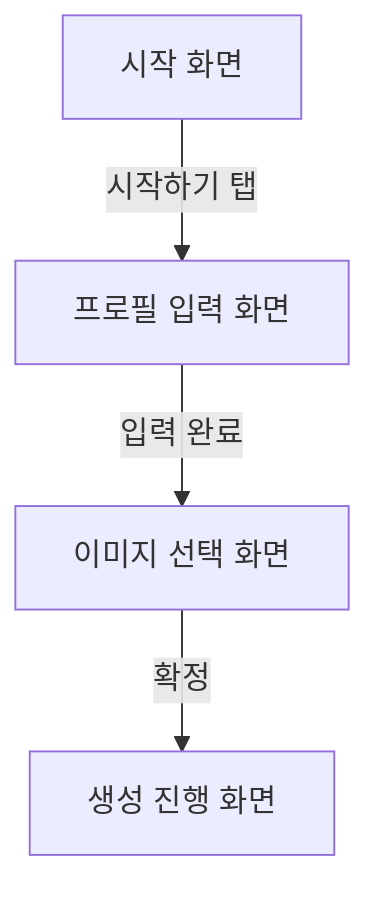

# Figma 흐름에서 구현까지

## 진행 흐름

1. 제공된 모든 시각 자료를 읽습니다.
2. 링크 순서를 화면 전이 순서로 간주하지 않습니다.
3. 화면 이름은 원시 Figma ID가 아니라 사용자가 이해할 수 있는 의미 기반 이름으로 붙입니다.
4. 추정한 전이를 Mermaid 흐름도로 작성합니다.
5. 사용자에게 화면 순서, 누락 요소, 전이 조건을 수정받습니다.
6. `tmp/` 아래 임시 UI 작업 문서를 갱신합니다.
7. 사용자가 요청하거나 확정한 뒤에만 최종 단일 UI 스펙/구현 문서를 작성합니다.
8. 문서가 확정되었거나 사용자가 명시적으로 구현을 요청한 뒤에만 구현합니다.

## 입력 선택지

Figma가 가장 흔하고 가능하면 우선 사용하지만 필수는 아닙니다.

허용 입력:

- Figma 플러그인 컨텍스트
- Figma 링크
- 스크린샷
- 화면 녹화
- 사용자가 작성한 화면 설명

가장 강한 입력을 사용합니다. Figma 플러그인 접근이 가능하면 우선 사용하고, 불가능하면 링크, 스크린샷, 설명으로 진행합니다.

## 임시 문서

파일명은 다음 형식을 사용합니다.

```text
tmp/YYYYMMDD-HHMM-feat-<topic>-ui-workflow.md
```

## 임시 문서 템플릿

```md
# UI 작업 문서

## 화면 목록

## 추정 화면 흐름

## Mermaid 흐름도

## 화면별 핵심 요소

## 사용자 확인 필요

## 확정된 전이 규칙

## 제외된 전이

## TL;DR

## 구현 범위

## 화면별 구현 요구사항

## 상태/에러/로딩 처리

## 기존 코드 연결 지점

## 검증 기준
```

## Mermaid 규칙

의미가 드러나는 라벨을 사용합니다.



사용자가 명시적으로 필요하다고 하지 않는 한 원시 Figma 노드 ID를 차트에 넣지 않습니다.

## 구현 규칙

- 수정 전 기존 라우팅, 컴포넌트 구조, 디자인 시스템을 확인합니다.
- 현재 앱의 패턴을 유지합니다.
- 사용자가 자연스럽게 기대하는 상태를 포함합니다: 로딩, 빈 상태, 에러, 비활성, 성공 상태.
- 프론트엔드 변경은 로컬 브라우저 대상이 있으면 시각적으로 검증합니다.
